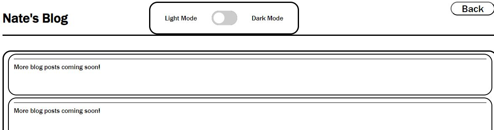

# My First Blog

## Description
This project entailed the design of a web blog with two pages for users to make blog posts about what's on their mind.  The first of the two pages is the "home" page or submission page.  It  simply has a title, image, and form through which users can submit their name, the title of their post, and the content of their post.  Upon submission, the user is taken to a second page which features a series of cards containing the 5 most recent blog posts.  On this page there is also a back button for the user to return to the submission page and make another post.  There is also a light/dark mode toggle feature to better adapt the page to the user's needs.

## Installation
N/A

## Usage
To use the webpage, follow [this link](https://njohnson2897.github.io/my-blog/)

The following screenshot demonstrates what the page should look like in a browser when the page first loads:

To make a blog post, enter your name, the title of your post, and the text content that you would like your post to include.  When you are happy with your post, click "Submit" at the bottom of the form and you will be taken to a page that looks like this:

In this screenshot, the cards are populated with placeholder text, but following your blog post submission they would be populated with what you submitted.

If you would prefer to view the page in dark mode, simply click the toggle switch and the screen should instead appear like this:

## Credits
I found code for the light/dark toggle switch here: https://www.w3schools.com/howto/howto_css_switch.asp
